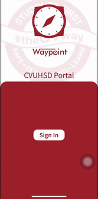

# WayPoint: CVUHSD Mobile Portal

WayPoint, CVUHSD's Mobile Portal, allows for quick, authenticated access in mobile devices to internal and 3rd-party CVUHSD staff service apps Two such services are PowerSchool and Canvas.  

Centinela Valley Union High School District Members sign in to WayPoint via their credentials on Active Directory single sign-on.   

If a service's app is not installed on a user's mobile device, the user is redirected to the app's Google Play Store/Apple Store link. If a service app does not exist at all, the user is redirected to the service's website.

Staff members and students may also submit helpdesk tickets and change their password via this app.

Built on React Native and Expo, this app provides a solution for staff members wishing to do the above in a quick and accessible manner.  

Soon to be available on the Apple App Store and Google Play Store. 

